# PDP Helper Data Flows

## Purpose
This document defines the required command, query, event, and persistence flow for each major v1 scenario. It is intentionally aligned with [use-cases.md](/Users/joakim/Documents/codex/PDP-helper/docs/use-cases.md) and [interface-catalog.md](/Users/joakim/Documents/codex/PDP-helper/docs/interface-catalog.md).

## Data Ownership
| Module | Owns |
| --- | --- |
| `gateway` | owner web session, capability cache, public API composition |
| `graph-service` | categories, canvases, nodes, edges, canonical skills, skill references |
| `planner-service` | goals, plan items, evidence notes, plan-item visibility state |
| `tracker-service` | workspace and goal progress projections |
| `recommendation-service` | recommendation runs, recommendations, recommendation decisions, provider health |
| `mcp-service` | API keys, MCP tool audit log, external tool policy enforcement |
| `postgres` | one cluster, isolated per-service schema |
| `nats` | cross-service event transport and durable subscriptions |

## Event Envelope
Every emitted domain event uses this envelope before the domain-specific payload:

```json
{
  "event_id": "evt_01JABCDEF0123456789ABCDE",
  "event_type": "pdp.v1.graph.node.created",
  "event_version": 1,
  "workspace_id": "wrk_01JABCDEF0123456789ABCDE",
  "producer": "graph-service",
  "occurred_at": "2026-04-22T08:00:00.000Z",
  "actor": {
    "actor_type": "user",
    "actor_id": "usr_01JABCDEF0123456789ABCDE"
  },
  "correlation_id": "cor_01JABCDEF0123456789ABCDE",
  "causation_id": "cmd_01JABCDEF0123456789ABCDE",
  "payload": {}
}
```

## DF-01 Brainstorm Editing
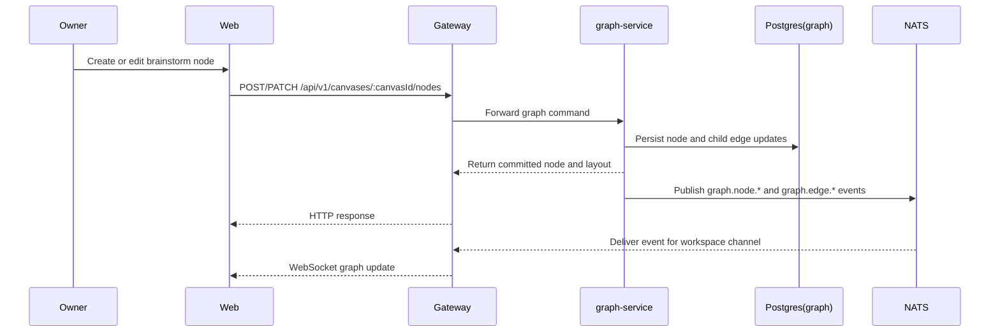

**Notes**
- Brainstorm commands are synchronous because the owner needs immediate edit confirmation.
- Layout is server-approved so the same canvas reads consistently across refreshes and external edits.
- Recommendation nodes are excluded from this flow; they are created only through DF-09 or DF-11.

## DF-02 Multiple Brainstorm Tabs
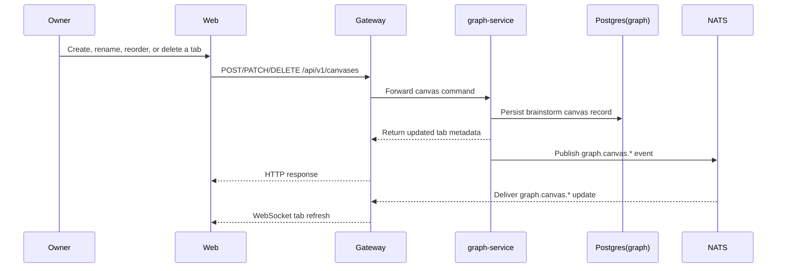

**Notes**
- Only `kind=brainstorm` canvases can be created or deleted in v1.
- The Skill Graph canvas is created automatically for the workspace and is not part of the user-managed tab lifecycle.

## DF-03 Skill Promotion
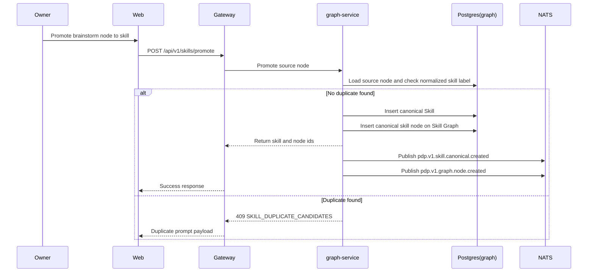

**Notes**
- Promotion never removes the original brainstorm node.
- Duplicate checking uses the normalized skill label within the same workspace only.

## DF-04 Duplicate Skill Resolution
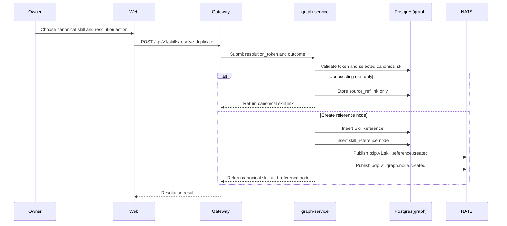

**Notes**
- No event is emitted for the duplicate prompt itself because no domain state changes yet.
- The resolution token expires quickly and is never persisted to long-term domain tables.

## DF-05 Goal Creation
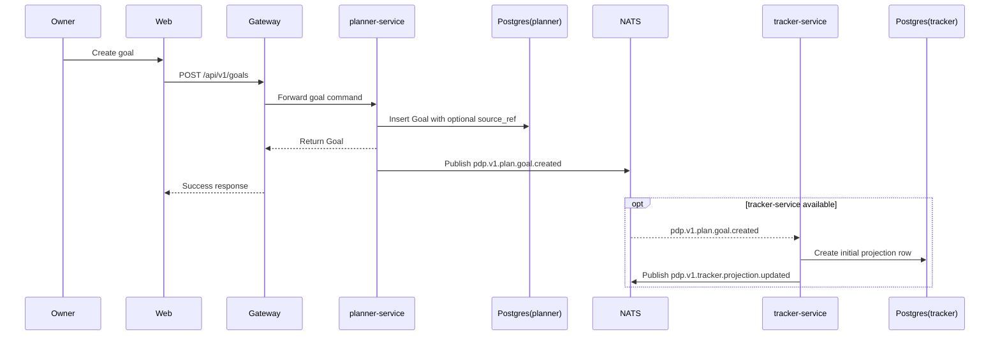

**Notes**
- Planner writes do not depend on tracker availability.
- `source_ref` is stored as a cross-service reference, not as a foreign key to another service’s table.

## DF-06 Plan Breakdown
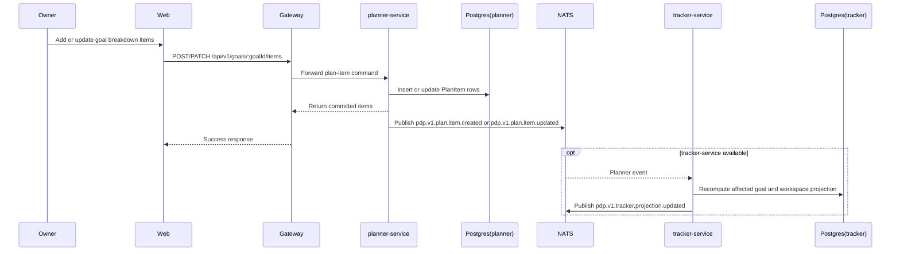

**Notes**
- Plan items can be `skill`, `milestone`, `task`, or `evidence`.
- Tracker projections are derived and can be rebuilt from planner events plus planner read repairs if needed.

## DF-07 Hide or Show a Plan Skill in the Skill Graph
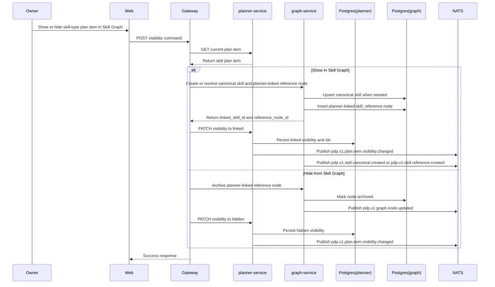

**Notes**
- The planner-linked reference node is disposable. The canonical skill is not deleted when a plan item is hidden.
- If duplicate resolution is needed during the show flow, control pauses and returns to the UI using the same conflict contract as skill promotion.
- Gateway owns the compensation step if graph creation succeeds but planner persistence fails.

## DF-08 Progress Updates and Tracker Reads
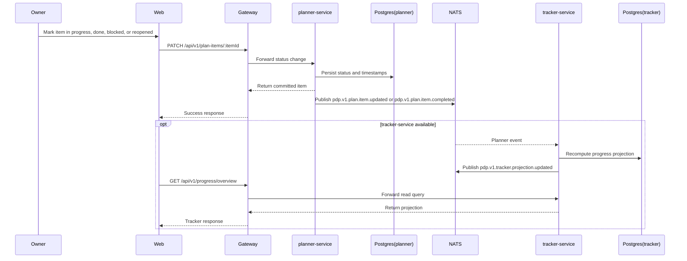

**Notes**
- Planner is the write owner for progress state.
- Tracker is read-only and must never be called to mutate goals or plan items.

## DF-09 Recommendation Generation
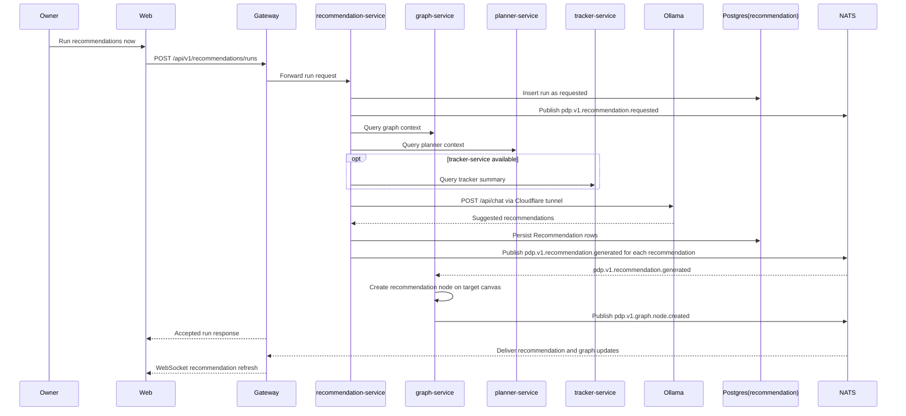

**Notes**
- Recommendations are first stored in `recommendation-service` and only then projected onto canvases as recommendation nodes.
- The Graph Service owns all node persistence, including recommendation nodes.

## DF-10 Accept or Deny a Recommendation
```mermaid
sequenceDiagram
    participant Actor as Owner or External LLM
    participant Entry as Gateway or MCP
    participant Rec as recommendation-service
    participant Domain as graph-service or planner-service
    participant RPG as Postgres(recommendation)
    participant NATS
    participant Graph as graph-service

    Actor->>Entry: Accept or deny recommendation
    Entry->>Rec: POST recommendation decision
    Rec->>RPG: Load recommendation and validate pending state
    alt Accept
        Rec->>Domain: Apply stored domain command
        Domain-->>Rec: Command success
        Rec->>RPG: Mark recommendation accepted
        Rec->>NATS: Publish pdp.v1.recommendation.accepted
    else Deny
        Rec->>RPG: Mark recommendation denied
        Rec->>NATS: Publish pdp.v1.recommendation.denied
    end
    NATS-->>Graph: Recommendation decision event
    Graph->>Graph: Mark recommendation node resolved
    Graph->>NATS: Publish pdp.v1.graph.node.updated
```

**Notes**
- A recommendation is authoritative only while still `pending`.
- If the stored command no longer validates, `recommendation-service` rejects accept with `RECOMMENDATION_STALE` and no decision event is emitted.

## DF-11 External MCP Read and Write
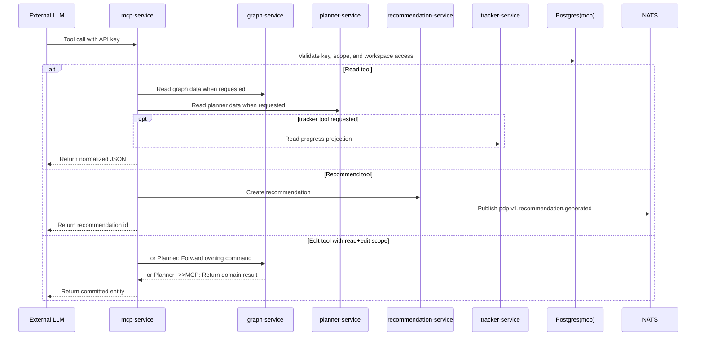

**Notes**
- `read-only` keys can call only read tools.
- `read+recommend` keys can read and create or decide recommendations, but cannot directly mutate first-class domain entities.
- `read+edit` keys can call domain edit tools and will receive the same conflicts and validation errors as the web app.

## DF-12 Provider Down
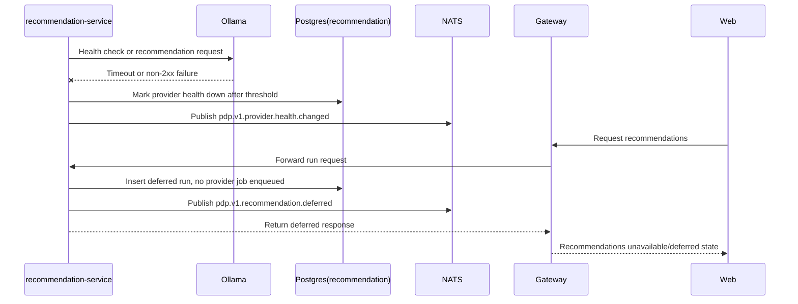

**Notes**
- While provider health is `down`, the system records demand but does not build a backlog of live jobs.
- The response to the caller is successful at the API layer but indicates `status=deferred`.

## DF-13 Provider Recovery
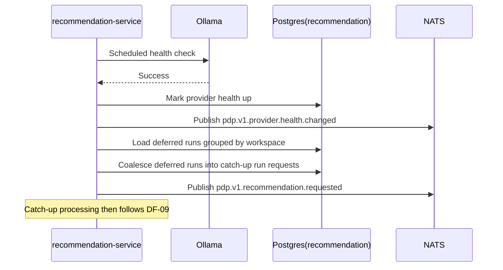

**Notes**
- Recovery creates at most one catch-up run per workspace for the deferred window in v1.
- Failed catch-up runs return to deferred state instead of recursively enqueuing new jobs.

## Cross-Flow Consistency Rules
- All cross-service references use service-neutral `EntityRef` values rather than database foreign keys.
- A recommendation node is a projection of a `Recommendation` record, not the source of truth itself.
- Planner visibility changes and Skill Graph rendering must remain consistent through explicit ids stored on the plan item: `linked_skill_id` and `skill_graph_reference_node_id`.
- Capability status is queryable through the Gateway and pushed over WebSocket whenever `pdp.v1.platform.capabilities.changed` or `pdp.v1.provider.health.changed` changes user-visible availability.
